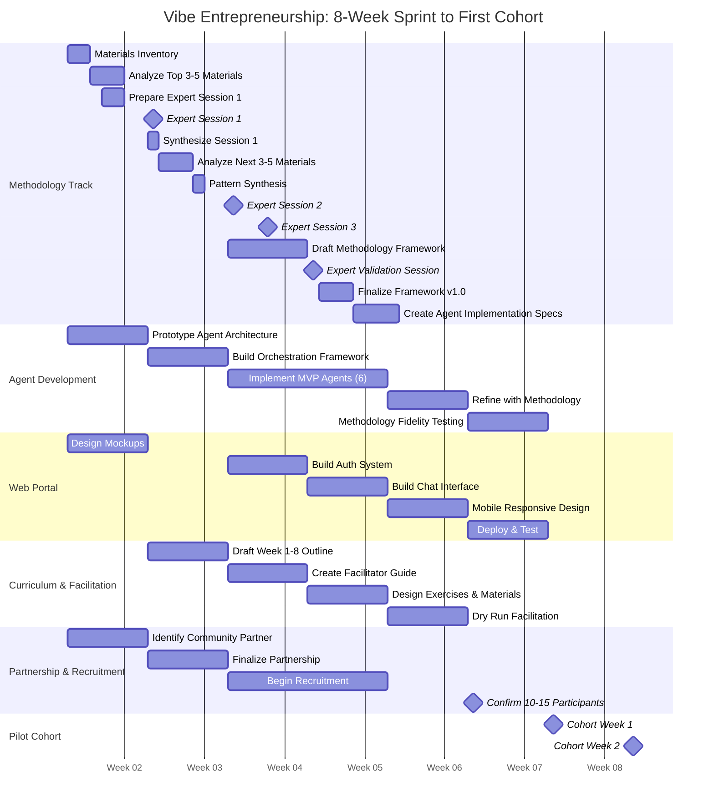
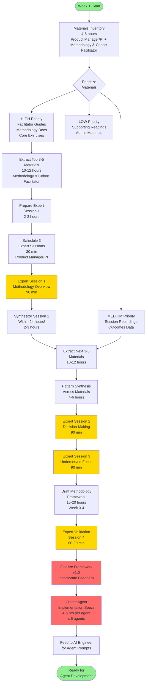
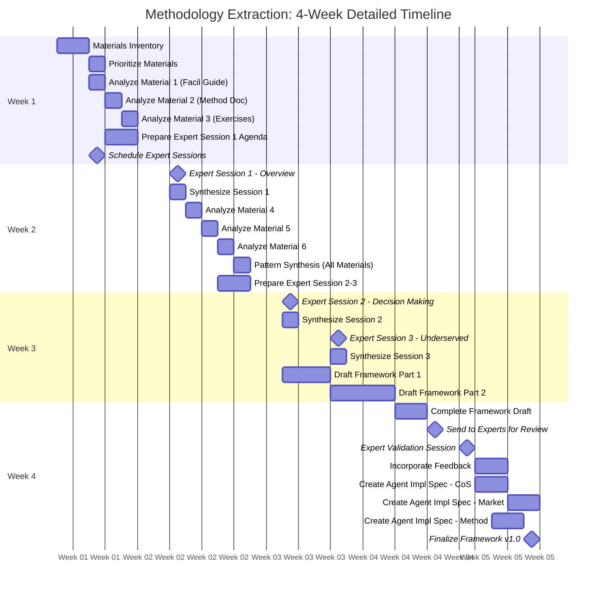
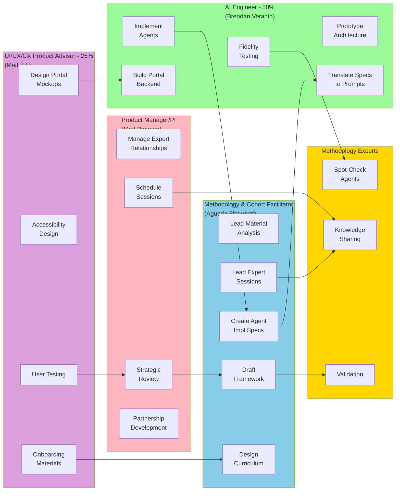
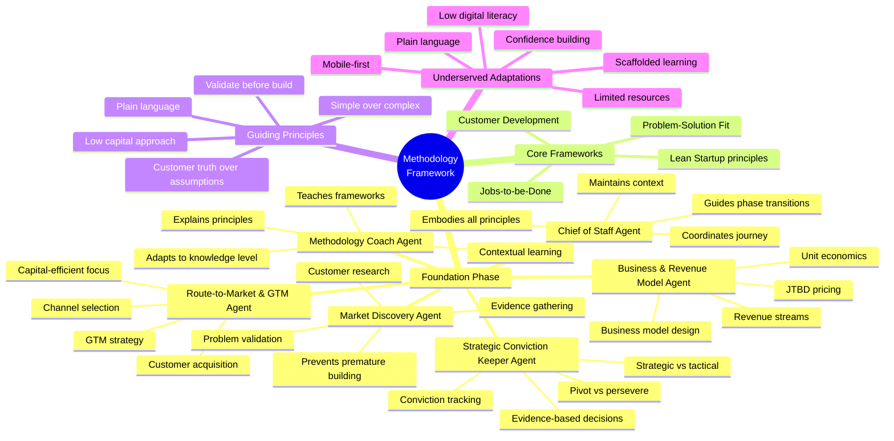
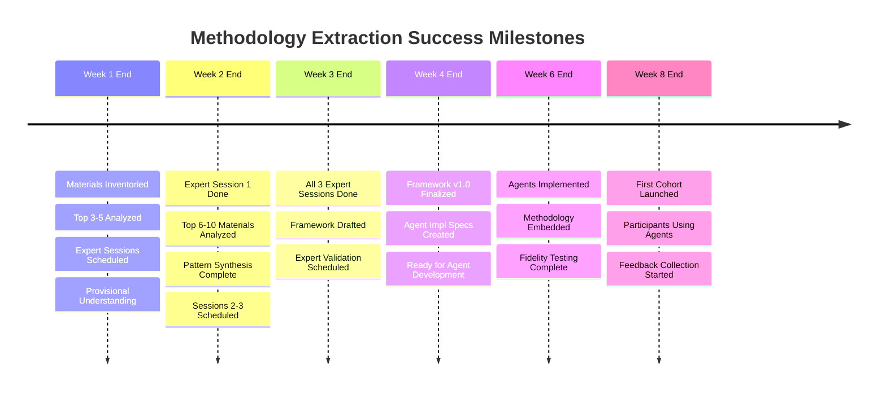
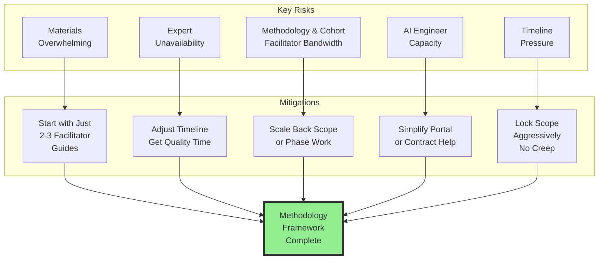

# Visual Roadmap: Vibe Entrepreneurship Launch

This document contains visual diagrams showing the 8-week sprint to first cohort, with emphasis on methodology extraction feeding into agent development.

---

## 1. Overall 8-Week Timeline (Gantt Chart)

---

## 2. Methodology Extraction Process Flow

---

## 3. Parallel Tracks: Methodology + Agent Development

```mermaid
flowchart LR
    subgraph Week1-2 ["Weeks 1-2: Foundation"]
        M1[Materials<br/>Inventory] --> M2[Analyze Top<br/>3-5 Materials]
        M2 --> M3[Expert<br/>Session 1]
        M3 --> M4[Pattern<br/>Synthesis]

        A1[Prototype<br/>Agent Arch] --> A2[Build<br/>Orchestration]
    end

    subgraph Week3-4 ["Weeks 3-4: Convergence"]
        M4 --> M5[Expert<br/>Sessions 2-3]
        M5 --> M6[Draft<br/>Framework]
        M6 --> M7[Expert<br/>Validation]
        M7 --> M8[Agent<br/>Impl Specs]

        A2 --> A3[Implement<br/>Agents]
        M8 -.Methodology<br/>Guidance.-> A3
        A3 --> A4[Refine with<br/>Methodology]
    end

    subgraph Week5-6 ["Weeks 5-6: Validation"]
        A4 --> A5[Methodology<br/>Fidelity Test]
        A5 --> A6[Expert<br/>Spot-Check]
        A6 --> A7[Refine<br/>Prompts]
    end

    subgraph Week7-8 ["Weeks 7-8: Launch"]
        A7 --> P1[Cohort<br/>Week 1]
        P1 --> P2[Cohort<br/>Week 2]
    end

    style M8 fill:#FF6B6B,stroke:#333,stroke-width:3px
    style A3 fill:#4169E1,stroke:#333,stroke-width:3px
    style P1 fill:#90EE90,stroke:#333,stroke-width:3px
    style P2 fill:#90EE90,stroke:#333,stroke-width:3px
```

---

## 4. System Architecture: How Components Connect

```mermaid
graph TB
    subgraph Sources ["Knowledge Sources"]
        Materials[Methodology<br/>Materials<br/>📚]
        Expert1[Expert 1<br/>👤]
        Expert2[Expert 2<br/>👤]
    end

    subgraph Extraction ["Extraction Process"]
        Analyze[Material<br/>Analysis]
        Sessions[Expert<br/>Sessions x3-4]
        Synthesize[Pattern<br/>Synthesis]
    end

    subgraph Framework ["Methodology Framework"]
        Meta[Meta-Structure<br/>Phases/Stages]
        Frameworks[Core Frameworks<br/>& Models]
        Principles[Guiding<br/>Principles]
        Adapt[Underserved<br/>Adaptations]
        Language[Language &<br/>Terminology]
    end

    subgraph Implementation ["Implementation Layer"]
        AgentSpecs[Agent<br/>Implementation<br/>Specs x3]
        CurriculumDesign[Curriculum<br/>Design<br/>Weeks 1-4]
        FacilGuide[Facilitator<br/>Guides]
    end

    subgraph Delivery ["Delivery System"]
        Agent1[Chief of<br/>Staff Agent]
        Agent2[Market<br/>Discovery Agent]
        Agent3[Methodology<br/>Coach Agent]
        Portal[Web<br/>Portal]
        Facilitator[Human<br/>Facilitator]
    end

    subgraph Cohort ["Pilot Cohort"]
        Participants[10-15<br/>Participants<br/>👥]
    end

    Materials --> Analyze
    Expert1 --> Sessions
    Expert2 --> Sessions
    Analyze --> Synthesize
    Sessions --> Synthesize

    Synthesize --> Meta
    Synthesize --> Frameworks
    Synthesize --> Principles
    Synthesize --> Adapt
    Synthesize --> Language

    Meta --> AgentSpecs
    Frameworks --> AgentSpecs
    Principles --> AgentSpecs
    Adapt --> AgentSpecs
    Language --> AgentSpecs

    Meta --> CurriculumDesign
    Frameworks --> CurriculumDesign

    Meta --> FacilGuide
    Principles --> FacilGuide

    AgentSpecs --> Agent1
    AgentSpecs --> Agent2
    AgentSpecs --> Agent3

    Agent1 --> Portal
    Agent2 --> Portal
    Agent3 --> Portal

    CurriculumDesign --> Facilitator
    FacilGuide --> Facilitator

    Portal --> Participants
    Facilitator --> Participants

    Participants -.Feedback.-> Agent1
    Participants -.Feedback.-> Agent2
    Participants -.Feedback.-> Agent3
    Participants -.Feedback.-> CurriculumDesign

    style Framework fill:#FFE4B5
    style Implementation fill:#E0FFFF
    style Delivery fill:#E6E6FA
    style Cohort fill:#90EE90
```

---

## 5. Methodology Extraction Detail (Week-by-Week)

---

## 6. Team Role Dependencies

---

## 7. Decision Points & Critical Path

```mermaid
flowchart TD
    Start([Start: Week 1]) --> D1{Materials<br/>Exist &<br/>Accessible?}

    D1 -->|Yes| Inventory[Do Inventory]
    D1 -->|No/Partial| GetMaterials[Request from<br/>Experts]

    GetMaterials --> Inventory

    Inventory --> D2{Experts<br/>Available<br/>Next 3 Weeks?}

    D2 -->|Yes| Schedule[Schedule<br/>3 Sessions]
    D2 -->|No| Negotiate[Negotiate<br/>Timeline]

    Schedule --> Analyze1[Analyze Top<br/>3-5 Materials]

    Analyze1 --> D3{Enough<br/>Clarity for<br/>Session 1?}

    D3 -->|Yes| ExpertS1[Expert<br/>Session 1]
    D3 -->|No| AnalyzeMore[Analyze 2-3<br/>More Materials]

    AnalyzeMore --> ExpertS1

    ExpertS1 --> ContinueAnalysis[Continue<br/>Material Analysis]

    ContinueAnalysis --> ExpertS2[Expert<br/>Session 2-3]

    ExpertS2 --> D4{Methodology & Cohort<br/>Facilitator Has<br/>15-20 hrs/week?}

    D4 -->|Yes| DraftFramework[Draft<br/>Framework]
    D4 -->|No| ScaleBack[Scale Back<br/>Scope or<br/>Extend Timeline]

    DraftFramework --> Validate[Expert<br/>Validation]

    Validate --> D5{Framework<br/>Approved?}

    D5 -->|Yes| CreateSpecs[Create Agent<br/>Impl Specs]
    D5 -->|No| Revise[Revise<br/>Framework]

    Revise --> Validate

    CreateSpecs --> D6{AI Engineer<br/>Ready?}

    D6 -->|Yes| Implement[Implement<br/>Agents]
    D6 -->|Parallel Track| Implement

    Implement --> End([Agents Embody<br/>Methodology])

    style Start fill:#90EE90
    style End fill:#90EE90
    style D1 fill:#FFD700
    style D2 fill:#FFD700
    style D3 fill:#FFD700
    style D4 fill:#FFD700
    style D5 fill:#FFD700
    style D6 fill:#FFD700
    style ExpertS1 fill:#FF6B6B
    style ExpertS2 fill:#FF6B6B
    style DraftFramework fill:#87CEEB
    style CreateSpecs fill:#87CEEB
```

---

## 8. MVP Agent Focus Areas

---

## 9. Success Metrics & Milestones

---

## 10. Risk Mitigation Map

---

## How to Use These Diagrams

### **For Team Alignment:**
- Use **Diagram 1 (Gantt)** to show overall 8-week timeline
- Use **Diagram 3 (Parallel Tracks)** to show methodology + agent development convergence

### **For Methodology Extraction:**
- Use **Diagram 2 (Process Flow)** to guide Methodology & Cohort Facilitator through extraction process
- Use **Diagram 5 (Detailed Timeline)** for week-by-week task planning

### **For Understanding System:**
- Use **Diagram 4 (System Architecture)** to show how methodology flows to agents to cohort
- Use **Diagram 8 (MVP Agent Focus)** to understand what each agent does with the methodology

### **For Team Coordination:**
- Use **Diagram 6 (Team Dependencies)** to clarify who does what and how roles interact

### **For Decision-Making:**
- Use **Diagram 7 (Decision Points)** to navigate critical choices
- Use **Diagram 10 (Risk Mitigation)** to plan for obstacles

### **For Tracking Progress:**
- Use **Diagram 9 (Success Milestones)** to measure progress week by week

---

## Viewing These Diagrams

**In GitHub/GitLab:**
These Mermaid diagrams render automatically in markdown preview.

**In VS Code:**
Install "Markdown Preview Mermaid Support" extension.

**Online:**
Copy diagram code to https://mermaid.live for interactive viewing/editing.

**In Documentation Tools:**
Most modern docs platforms (Notion, Confluence, etc.) support Mermaid.

---

## Customizing These Diagrams

All diagrams are in Mermaid format and can be:
- Edited directly in this markdown file
- Exported to PNG/SVG from mermaid.live
- Customized with different colors, styles, layouts
- Extended with more detail as needed

Feel free to modify dates, add tasks, adjust dependencies to match your actual execution!
