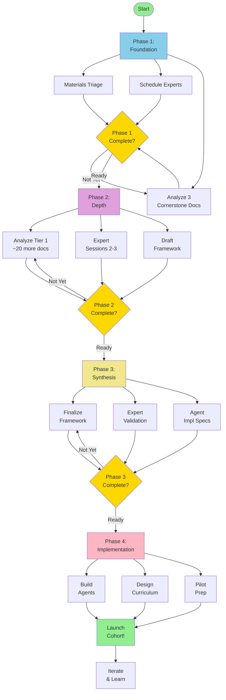

# Workflow Roadmap: Vibe Entrepreneurship

**Approach:** Workflow-driven (not deadline-driven) | **Learn velocity as we go** | **Sustainable pace**

**Last Updated:** 2025-11-03

---

## Philosophy: Phases Over Timelines

With **500+ documents + videos** to analyze, rigid timelines are counterproductive. Instead:

✅ **Clear workflow:** "Here's what to do now, here's what's next"
✅ **Dependency-driven:** Move to next phase when ready (not by date)
✅ **Learn velocity:** Track effort, project future phases realistically
✅ **Sustainable:** Team doesn't burn out chasing artificial deadlines
✅ **Adaptive:** Adjust based on what we learn

---

## Current Phase: Foundation

### 🎯 Phase Goal
Get oriented with materials and experts. Establish extraction velocity. Build enough understanding to guide agent development.

### 📍 Current Focus (Priority Order)

#### **Priority 1: Strategic Materials Triage** ⏳ Estimated: 4-8 hours
**Who:** Methodology & Cohort Facilitator (lead) + You (support)

**Don't catalog all 500+ docs in detail!** Instead, triage:

**Action:**
1. **Quick scan** of materials collection
2. **Categorize** into Tiers (see framework below)
3. **Count** rough distribution per tier
4. **Identify** top 20-30 Tier 1 docs
5. **Prioritize** Tier 1 in analysis order

**Output:**
- Tier 1 list (20-30 docs, prioritized)
- Rough count of Tier 2/3
- "We'll analyze Tier 1 first, reference Tier 2 selectively, defer Tier 3"

**Done when:** You know which 20-30 docs to analyze first

**Template:** `docs/templates/materials-triage.md` (to be created)

---

#### **Priority 2: Schedule Expert Sessions** ⏳ Estimated: 30 min
**Who:** You (PM)

**Why urgent:** Expert availability is the constraint, lock it in!

**Action:**
1. Contact both methodology creators
2. Explain project context (use `ONE-PAGE-SUMMARY.md`)
3. Request 3 x 90-min sessions (spread over next 4-8 weeks is fine!)
4. Schedule Session 1 first (others can float)

**Output:**
- Expert Session 1 scheduled (ideally within 2-3 weeks)
- Expert Sessions 2-3 tentatively scheduled
- Experts briefed on project

**Done when:** Session 1 date confirmed, experts enthusiastic

---

#### **Priority 3: Analyze 3 "Cornerstone" Materials** ⏳ Estimated: 6-9 hours
**Who:** Methodology & Cohort Facilitator

**Pick the 3 most valuable documents:**
- **Material A:** Primary facilitator guide (if one exists)
- **Material B:** Methodology overview/framework doc
- **Material C:** Best case study or engagement record

**Action:**
1. Deep extraction using template (`docs/templates/material-extraction.md`)
2. **TIME YOURSELF!** Track hours per material
3. Document frameworks, principles, language, sequence
4. Note questions for experts

**Output:**
- 3 extraction documents
- Provisional understanding of methodology
- Questions list for Expert Session 1
- **Velocity data:** "Material analysis takes ~X hours per doc"

**Done when:** You can describe the methodology's core approach in 2-3 paragraphs

**Velocity Learning:** Track time for each material to project Tier 1 effort

---

#### **Priority 4: Prepare Expert Session 1** ⏳ Estimated: 2-3 hours
**Who:** Methodology & Cohort Facilitator (draft) + You (review)

**Action:**
1. Review 3 cornerstone material extractions
2. Customize `docs/templates/expert-session-1-agenda.md`
3. Draft hypotheses: "We think your methodology emphasizes X..."
4. Draft questions: "We couldn't figure out Y..."
5. Send agenda to experts 2-3 days before session

**Output:** Expert Session 1 agenda with targeted questions

**Done when:** Agenda sent to experts, they've reviewed it

---

### 🚦 Gate to Next Phase

**Ready to move to Phase 2 when:**
- [ ] Tier 1 materials identified (~20-30 docs)
- [ ] Expert Session 1 scheduled
- [ ] 3 cornerstone materials analyzed
- [ ] Extraction velocity established (X hrs per doc)
- [ ] Expert Session 1 completed and synthesized
- [ ] Core methodology principles understood (even if incomplete)

**Don't rush!** Phase 1 might take 2-4 weeks depending on team availability. That's fine.

---

## Upcoming Phase: Depth

### 🎯 Phase Goal
Extract core frameworks, principles, and language from Tier 1 materials. Run expert deep-dive sessions. Draft provisional methodology framework.

### 📋 Next Up (Not Started Yet)

#### **Focus Area A: Continue Tier 1 Analysis**
**Action:** Analyze remaining Tier 1 materials (~17-27 docs, based on cornerstone pace)
**Approach:**
- Prioritize facilitator guides first
- Then methodology docs
- Then key case studies
- Track velocity (adjust estimates as you go)

**Velocity projection example:**
```
Cornerstone pace: 2.5 hours per doc
Remaining Tier 1: 20 docs
Estimated effort: 50 hours
At 10 hrs/week: 5 weeks
At 15 hrs/week: 3-4 weeks
```

---

#### **Focus Area B: Expert Sessions 2-3**
**Action:** Run decision-making and underserved adaptations sessions
**Timing:** After 8-10 Tier 1 materials analyzed (enough context for deep questions)
**Output:**
- Expert Session 2: Decision-making frameworks, facilitation wisdom
- Expert Session 3: Underserved population adaptations

---

#### **Focus Area C: Draft Provisional Framework**
**Action:** Start synthesizing patterns across analyzed materials
**Approach:** Living document (iterate as you analyze more)
**Output:** Provisional methodology framework (gets better over time)

---

### 🚦 Gate to Next Phase

**Ready to move to Phase 3 when:**
- [ ] Majority of Tier 1 analyzed (15-20 of 20-30 docs)
- [ ] Expert Sessions 2-3 completed
- [ ] Pattern synthesis reveals core frameworks and principles
- [ ] Provisional framework drafted (even if incomplete)
- [ ] Confident enough to write agent implementation specs

**Don't need 100% of materials analyzed!** Aim for 80% clarity from 20% of effort (Pareto).

---

## Future Phase: Synthesis

### 🎯 Phase Goal
Synthesize methodology framework. Validate with experts. Create agent implementation specs. Prepare for agent development.

### ⏸️ Backlog (Will Do Later)

#### **Focus Area A: Complete Framework**
**Action:** Finalize methodology framework document
**Includes:**
- Meta-structure (phases/stages)
- Core frameworks and models
- Guiding principles
- Critical decision points
- Underserved adaptations
- Language and terminology
- Agent integration specs

---

#### **Focus Area B: Expert Validation**
**Action:** Expert Session 4 (validation)
**Format:** Show framework, get feedback, iterate
**Output:** Expert-validated framework v1.0

---

#### **Focus Area C: Agent Implementation Specs**
**Action:** Translate framework into agent-specific guidance
**For each MVP agent:**
- How it teaches the methodology
- What frameworks it uses
- What principles it embodies
- Language and tone
- Example interactions
- Handoff criteria to human

---

### 🚦 Gate to Next Phase

**Ready to move to Phase 4 when:**
- [ ] Methodology framework validated by experts
- [ ] Agent implementation specs created for 3 MVP agents
- [ ] AI Engineer understands what agents need to teach
- [ ] Methodology & Cohort Facilitator can design curriculum using framework

---

## Final Phase: Implementation

### 🎯 Phase Goal
Build agents that embody methodology. Design cohort curriculum. Prepare pilot cohort. Launch!

### ⏸️ Backlog (Future)

#### **Focus Area A: Agent Development**
**Action:** AI Engineer implements 3 MVP agents
**Input:** Agent implementation specs from Phase 3
**Process:**
- Translate specs into agent prompts
- Implement with methodology embedded
- Test for methodology fidelity
- Refine based on testing

---

#### **Focus Area B: Curriculum Design**
**Action:** Methodology & Cohort Facilitator designs 4-week cohort curriculum
**Based on:** Methodology framework
**Output:**
- Week 1-4 session plans
- Facilitator guides
- Participant materials
- Agent interaction assignments

---

#### **Focus Area C: Pilot Preparation**
**Action:** Recruit participants, finalize logistics, prepare team
**Includes:**
- Community partner engagement
- Participant recruitment (10-15 people)
- Portal deployment
- Team dry-run

---

#### **Focus Area D: Pilot Launch**
**Action:** Run first cohort!
**Focus:** Learn, iterate, collect feedback
**Mindset:** This is research, not perfection

---

## Workflow Diagram



---

## Parallel Tracks (While Methodology Extraction Happens)

### Track 1: AI Engineer (Low Priority Until Phase 3)

**Phase 1-2 (Foundation & Depth):**
- Prototype agent architecture (5-10% time)
- Build orchestration framework
- Experiment with LLM APIs
- **Wait** for methodology framework (don't build agents yet!)

**Phase 3 (Synthesis):**
- Receive agent implementation specs
- Begin translating to agent prompts (20% time)

**Phase 4 (Implementation):**
- Full agent development (30-50% time)

---

### Track 2: You (PM/PI)

**Phase 1-2:**
- Expert relationship management (4-8 hrs/week)
- Strategic review of methodology extraction
- Community partner outreach
- Project coordination

**Phase 3-4:**
- Partnership finalization
- Participant recruitment
- Logistics coordination
- Team support

---

### Track 3: Community Partner Development

**Can happen in parallel to methodology extraction:**
- Identify potential partners
- Build relationships
- Explain program vision
- Secure commitment
- Plan recruitment approach

**Timeline:** Flexible, but aim to have partner confirmed before Phase 4

---

## Velocity Tracking Template

### Week 1 Velocity Learning

**Materials Analyzed:**
- Material A: ___ hours
- Material B: ___ hours
- Material C: ___ hours
- **Average:** ___ hours per material

**Expert Sessions:**
- Scheduling: ___ hours
- Prep: ___ hours
- Session: ___ hours
- Synthesis: ___ hours
- **Total:** ___ hours per expert session

**Projections Based on Week 1:**
- Remaining Tier 1 docs: ___ docs
- At ___ hrs per doc: ___ total hours
- Methodology & Cohort Facilitator capacity: ___ hrs/week
- **Projected Phase 2 duration:** ___ weeks

---

### Ongoing Velocity Tracking

**Update every 2 weeks:**

| Date | Materials Analyzed (cumulative) | Hours Spent | Avg hrs/doc | Projection |
|------|-------------------------------|-------------|-------------|------------|
| Week 1 | 3 docs | 8 hrs | 2.7 hrs | Tier 1 = 55 hrs |
| Week 3 | 8 docs | 21 hrs | 2.6 hrs | Tier 1 = 52 hrs |
| Week 5 | 15 docs | 38 hrs | 2.5 hrs | Tier 1 = 50 hrs |

**Use this to:**
- Set realistic expectations
- Adjust team capacity if needed
- Know when you'll be ready for next phase
- Communicate progress to stakeholders

---

## Current Focus Dashboard

Use this as your team's "home base" - always know what's next!

---

### 📍 CURRENT FOCUS (This Phase)

**Phase 1: Foundation**

- [ ] Strategic materials triage (4-8 hrs)
- [ ] Schedule Expert Sessions 1-3 (30 min)
- [ ] Analyze Material A: [Name] (est. 2-3 hrs)
- [ ] Analyze Material B: [Name] (est. 2-3 hrs)
- [ ] Analyze Material C: [Name] (est. 2-3 hrs)
- [ ] Prepare Expert Session 1 agenda (2-3 hrs)
- [ ] Run Expert Session 1 (90 min)
- [ ] Synthesize Expert Session 1 (2-3 hrs)

**Total estimated:** 15-25 hours
**At 15 hrs/week:** 1-2 weeks
**At 10 hrs/week:** 2-3 weeks

---

### 📋 NEXT UP (Phase 2: Depth)

*Don't start until Phase 1 complete!*

- [ ] Analyze Tier 1 materials (prioritized list)
- [ ] Run Expert Sessions 2-3
- [ ] Draft provisional methodology framework
- [ ] Pattern synthesis across materials
- [ ] Prepare for Phase 3

**Will estimate duration after Phase 1 velocity established**

---

### ⏸️ BACKLOG (Phases 3-4)

*Will detail when Phase 2 is underway*

- Agent implementation specs
- Expert validation
- Agent development
- Curriculum design
- Pilot preparation
- Cohort launch

---

### ✅ DONE

- [x] Git repository initialized
- [x] Documentation structure created
- [x] Strategic planning documents written
- [x] Agent specifications imported
- [x] Templates created
- [x] Visual roadmaps created
- [x] Repository pushed to GitHub

---

## Decision Log

Track key decisions as they're made (dates flexible):

| Decision | Made When | Outcome | Impact |
|----------|-----------|---------|--------|
| Materials approach | 2025-11-03 | Triage to Tiers, focus on Tier 1 | Realistic scope for 500+ docs |
| Timeline approach | 2025-11-03 | Workflow-driven, not deadline-driven | Sustainable pace, learn velocity |
| MVP agents | TBD | [3 agents decision] | [Scope for Phase 4] |
| Community partner | TBD | [Partner name] | [Recruitment approach] |
| Cohort format | TBD | [Virtual/hybrid] | [Accessibility approach] |

---

## Success Indicators (Qualitative)

Instead of deadlines, track qualitative progress:

### Phase 1 Success Indicators:
- ✅ Methodology & Cohort Facilitator can articulate core methodology in 2-3 paragraphs
- ✅ Team knows which 20-30 materials to prioritize
- ✅ Expert Session 1 provided valuable insights
- ✅ Extraction velocity established and realistic
- ✅ Confident to continue Tier 1 analysis

### Phase 2 Success Indicators:
- ✅ Patterns emerging across materials (frameworks repeated)
- ✅ Expert sessions revealing tacit knowledge
- ✅ Provisional framework feels accurate (even if incomplete)
- ✅ Could start writing agent implementation specs if needed
- ✅ Confident about underserved population adaptations

### Phase 3 Success Indicators:
- ✅ Experts validate framework ("Yes, that's our methodology!")
- ✅ Framework captures what makes methodology unique
- ✅ Agent specs clearly guide AI Engineer
- ✅ Methodology & Cohort Facilitator can design curriculum from framework
- ✅ Team confidence high for implementation phase

### Phase 4 Success Indicators:
- ✅ Agents teach the methodology (not generic advice)
- ✅ Expert spot-check confirms fidelity
- ✅ Curriculum aligns with methodology
- ✅ Team prepared and excited for pilot
- ✅ 10-15 participants recruited and confirmed

---

## Adaptation Points

**When to adjust approach:**

### If Materials Analysis Taking Too Long:
- **Recognize:** After 5-10 docs, if velocity is slow
- **Adjust:** Narrow Tier 1 further, or increase Methodology & Cohort Facilitator time
- **Don't:** Rush analysis or compromise quality

### If Expert Sessions Reveal Materials Are Incomplete:
- **Recognize:** Experts say "That's not quite right" repeatedly
- **Adjust:** Add specific materials they reference to Tier 1
- **Don't:** Assume materials contain everything

### If Team Capacity Changes:
- **Recognize:** Methodology & Cohort Facilitator availability drops
- **Adjust:** Slow pace, extend phases, or bring in support
- **Don't:** Force unrealistic pace

### If Agent Development Can't Wait:
- **Recognize:** Technical constraints or opportunities
- **Adjust:** Create provisional agent specs from incomplete framework
- **Iterate:** Refine agents as framework solidifies
- **Don't:** Build agents with no methodology guidance

---

## Communication Cadence

**Weekly Check-ins (30-60 min):**
- What's done this week?
- What's in progress?
- Any blockers?
- What's focus for next week?
- Velocity check (on track?)

**Phase Transitions (90 min):**
- Review phase completion criteria
- Decide if ready to move forward
- Adjust next phase plan based on learnings
- Celebrate progress!

**Ad-hoc as Needed:**
- When stuck or blocked
- When major decision needed
- When velocity significantly off

---

## Why This Workflow Approach Works

✅ **Sustainable:** No artificial pressure from arbitrary deadlines
✅ **Adaptive:** Learn velocity, adjust estimates in real-time
✅ **Realistic:** Acknowledges 500+ docs is HUGE scope
✅ **Focused:** Clear current focus, clear next steps
✅ **Transparent:** Team always knows where we are
✅ **Learning-oriented:** Capture velocity data for future planning
✅ **Dependencies clear:** Move forward when ready, not by calendar
✅ **Reduces stress:** "Here's what to do" not "We're behind schedule"

---

## The Bottom Line

**Timeline for first cohort launch:**
- **Honest answer:** Unknown until we learn velocity
- **Rough estimate:** 3-6 months (could be shorter or longer)
- **How we'll know:** After Phase 1, we'll have real data

**What matters more than timeline:**
- Quality of methodology extraction
- Agent fidelity to methodology
- Team sustainability
- Confidence when launching pilot

**This is research and development, not manufacturing.**
We learn as we go, adapt based on what we discover, and launch when we're ready.

---

**Current Status:** Phase 1 (Foundation) - Ready to start!

**First Action:** Strategic materials triage (4-8 hours)

**Next Milestone:** Expert Session 1 scheduled and completed
